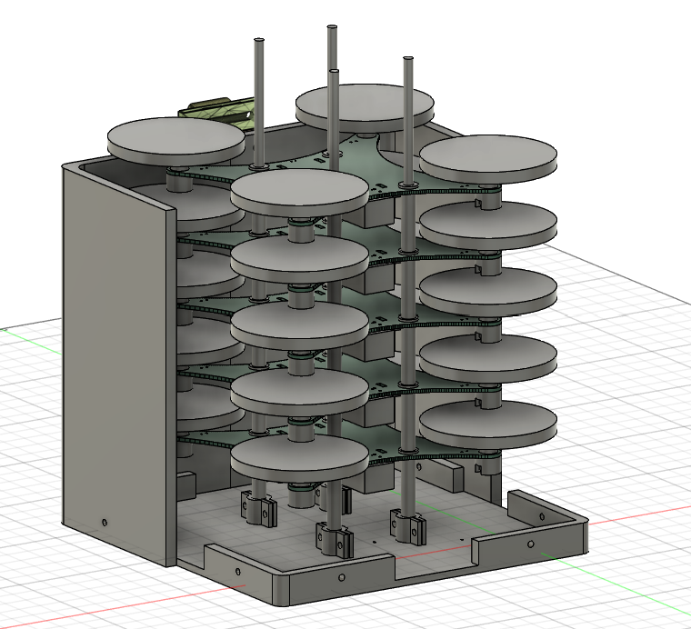
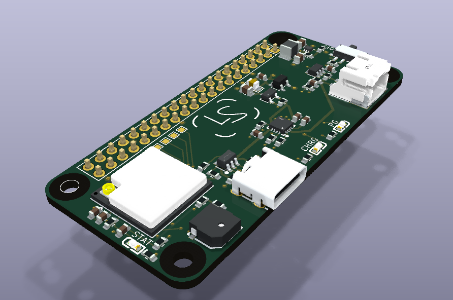
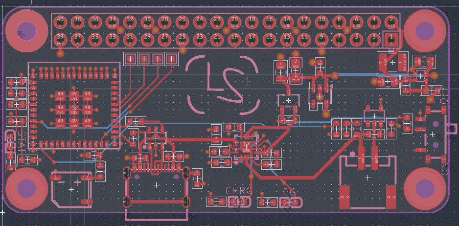
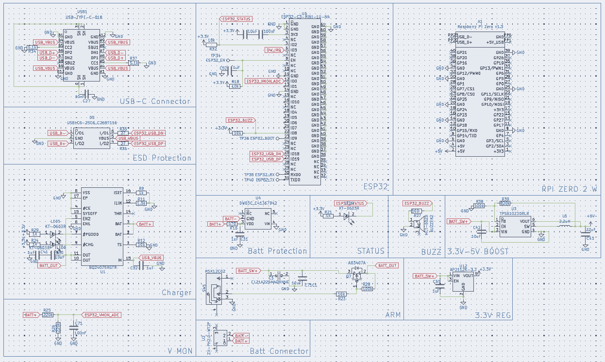

# LS Mk.1 Drone Launcher
Compact drone launcher + central compute module

## 3D Model Preview

## 3D PCB Preview

## Wiring

## Schematic

### Download ./latestProduction to begin fabricating the PCB

## Introduction

## Bill of Materials 

### (Minimum build for testing: 5 drones)

| Quantity | Components | Price | Link |
|--------- |----------|----------| -----|
|   |  | ~$ | [here]()

Total cost: **$**

Cost per drone: **$**

----
